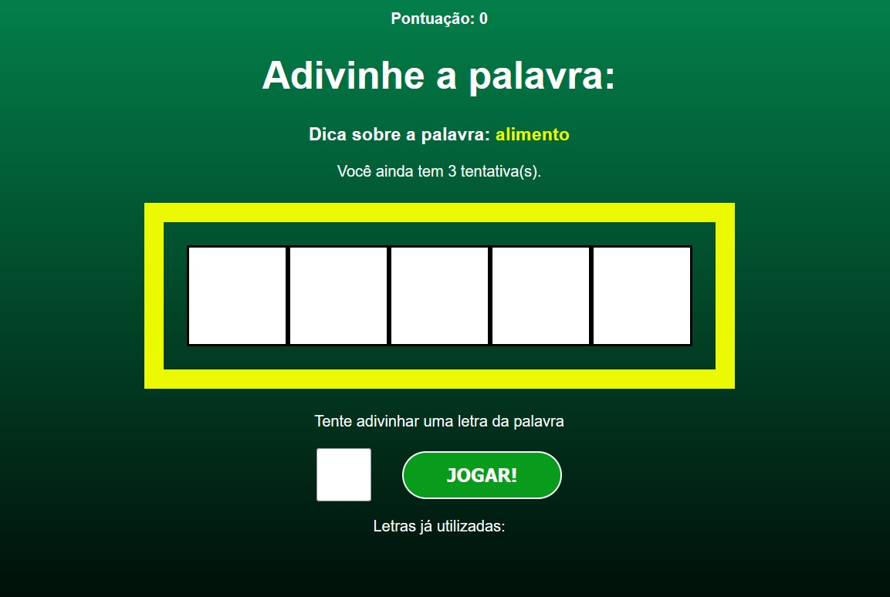

## 📝 Projeto Secret Word

Projeto utilizando o framework React, para construnção de um jogo onde o usuário deverá adivinhar a palavra secreta, abordado no curso de react hora de codar.

## 💻 Screenshot do projeto

Designer 01



<h4 align="center"><a href="https://palavra-secreta-projeto-react.netlify.app/">Clique aqui e visite o projeto</a></h4>

## 📚 Descrição

Construir um jogo onde o usuário deverá adivinhar a palavra através de uma dica. É utilizado o React para base do projeto:
Em desenvolvimento...

- Para rodar o projeto, certifique-se de estar na página principal e digite o comando abaixo no terminal:
```
npm install
```
- Após a instalação, execute o comando abaixo no terminal:
```
npm start
```
## 💼 Tecnologias utilizadas

- React;
- JavaScript;
- HTML;
- CSS;


## 🙋🏻‍♂️ Autor

Bruno Oliveira

